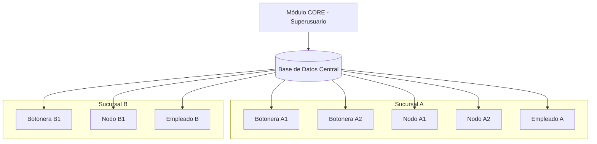

# 🚀 Guía de Inicialización - Sistema Modular de Gestión de Colas

## 📋 Fase 1: Planificación y Arquitectura (Semana 1-2)

### 1.1 Definición de Arquitectura Modular



### 1.2 Estructura de Directorios Propuesta

```
sistema-colas-modular/
├── core-module/                 # Módulo CORE (Superusuario)
├── botonera-module/            # Módulo Botonera
├── nodo-module/                # Módulo Nodo
├── empleado-module/            # Módulo Empleado
├── admin-module/               # Módulo Administrador
├── shared/                     # Componentes compartidos
│   ├── database/              # Esquemas y migraciones
│   ├── types/                 # Tipos TypeScript compartidos
│   ├── services/              # Servicios de base de datos
│   ├── utils/                 # Utilidades compartidas
│   └── components/            # Componentes UI reutilizables
├── license-system/            # Sistema de licencias
└── deployment/                # Configuración de despliegue
```

## 🗄️ Fase 2: Diseño de Base de Datos (Semana 2-3)

### 2.1 Esquema de Base de Datos Extendido

**PRIORIDAD ALTA - Crear estas tablas primero:**

```sql
-- Tabla de empresas/organizaciones
CREATE TABLE companies (
    id UUID PRIMARY KEY DEFAULT gen_random_uuid(),
    name VARCHAR(255) NOT NULL,
    legal_name VARCHAR(255),
    tax_id VARCHAR(50) UNIQUE,
    address TEXT,
    phone VARCHAR(20),
    email VARCHAR(100),
    website VARCHAR(255),
    logo_url TEXT,
    is_active BOOLEAN DEFAULT true,
    license_key VARCHAR(255) UNIQUE,
    license_expires_at TIMESTAMP,
    max_branches INTEGER DEFAULT 1,
    max_employees INTEGER DEFAULT 10,
    created_at TIMESTAMP DEFAULT CURRENT_TIMESTAMP,
    updated_at TIMESTAMP DEFAULT CURRENT_TIMESTAMP
);

-- Tabla de sucursales
CREATE TABLE branches (
    id UUID PRIMARY KEY DEFAULT gen_random_uuid(),
    company_id UUID NOT NULL REFERENCES companies(id),
    name VARCHAR(255) NOT NULL,
    code VARCHAR(20) NOT NULL, -- Código único por empresa
    address TEXT,
    phone VARCHAR(20),
    manager_name VARCHAR(255),
    is_active BOOLEAN DEFAULT true,
    timezone VARCHAR(50) DEFAULT 'America/Mexico_City',
    business_hours JSONB, -- Horarios de operación
    configuration JSONB, -- Configuración específica de la sucursal
    created_at TIMESTAMP DEFAULT CURRENT_TIMESTAMP,
    updated_at TIMESTAMP DEFAULT CURRENT_TIMESTAMP,
    UNIQUE(company_id, code)
);

-- Tabla de estaciones/dispositivos
CREATE TABLE stations (
    id UUID PRIMARY KEY DEFAULT gen_random_uuid(),
    branch_id UUID NOT NULL REFERENCES branches(id),
    station_code VARCHAR(50) NOT NULL,
    station_type VARCHAR(20) NOT NULL CHECK (station_type IN ('botonera', 'nodo', 'empleado')),
    name VARCHAR(255) NOT NULL,
    description TEXT,
    hardware_id VARCHAR(255), -- ID único del hardware
    ip_address INET,
    location VARCHAR(255), -- Ubicación física
    configuration JSONB, -- Configuración específica
    is_active BOOLEAN DEFAULT true,
    last_heartbeat TIMESTAMP,
    created_at TIMESTAMP DEFAULT CURRENT_TIMESTAMP,
    updated_at TIMESTAMP DEFAULT CURRENT_TIMESTAMP,
    UNIQUE(branch_id, station_code)
);

-- Tabla de licencias
CREATE TABLE licenses (
    id UUID PRIMARY KEY DEFAULT gen_random_uuid(),
    company_id UUID NOT NULL REFERENCES companies(id),
    license_key VARCHAR(255) UNIQUE NOT NULL,
    license_type VARCHAR(50) NOT NULL, -- 'trial', 'basic', 'professional', 'enterprise'
    features JSONB NOT NULL, -- Características habilitadas
    max_branches INTEGER NOT NULL,
    max_employees INTEGER NOT NULL,
    max_stations INTEGER NOT NULL,
    issued_at TIMESTAMP DEFAULT CURRENT_TIMESTAMP,
    expires_at TIMESTAMP NOT NULL,
    is_active BOOLEAN DEFAULT true,
    created_by VARCHAR(255), -- Quien emitió la licencia
    notes TEXT
);
```

### 2.2 Modificación de Tablas Existentes

```sql
-- Agregar campos de multi-sucursal a tablas existentes
ALTER TABLE employees ADD COLUMN branch_id UUID REFERENCES branches(id);
ALTER TABLE employees ADD COLUMN station_id UUID REFERENCES stations(id);
ALTER TABLE employees ADD COLUMN specializations JSONB; -- Especializaciones del empleado

ALTER TABLE tickets ADD COLUMN branch_id UUID REFERENCES branches(id);
ALTER TABLE tickets ADD COLUMN station_id UUID REFERENCES stations(id);

ALTER TABLE service_categories ADD COLUMN branch_id UUID REFERENCES branches(id);
ALTER TABLE service_categories ADD COLUMN company_id UUID REFERENCES companies(id);

-- Índices para optimización
CREATE INDEX idx_branches_company_id ON branches(company_id);
CREATE INDEX idx_stations_branch_id ON stations(branch_id);
CREATE INDEX idx_employees_branch_id ON employees(branch_id);
CREATE INDEX idx_tickets_branch_id ON tickets(branch_id);
```

## 🔧 Fase 3: Configuración del Entorno de Desarrollo (Semana 3)

### 3.1 Configuración de Monorepo

```bash
# 1. Crear estructura de monorepo
mkdir sistema-colas-modular
cd sistema-colas-modular

# 2. Inicializar workspace
npm init -w core-module -w botonera-module -w nodo-module -w empleado-module -w admin-module

# 3. Configurar herramientas compartidas
npm install -D typescript @types/node eslint prettier
npm install -D concurrently cross-env
```

### 3.2 Configuración de Base de Datos

```typescript
// shared/database/config.ts
export interface DatabaseConfig {
  host: string;
  port: number;
  database: string;
  username: string;
  password: string;
  ssl?: boolean;
}

export const getDatabaseConfig = (): DatabaseConfig => {
  return {
    host: process.env.DB_HOST || 'localhost',
    port: parseInt(process.env.DB_PORT || '5432'),
    database: process.env.DB_NAME || 'colas_system',
    username: process.env.DB_USER || 'postgres',
    password: process.env.DB_PASSWORD || '',
    ssl: process.env.NODE_ENV === 'production'
  };
};
```

### 3.3 Sistema de Tipos Compartidos

```typescript
// shared/types/core.ts
export interface Company {
  id: string;
  name: string;
  legalName?: string;
  taxId?: string;
  address?: string;
  phone?: string;
  email?: string;
  website?: string;
  logoUrl?: string;
  isActive: boolean;
  licenseKey?: string;
  licenseExpiresAt?: Date;
  maxBranches: number;
  maxEmployees: number;
  createdAt: Date;
  updatedAt: Date;
}

export interface Branch {
  id: string;
  companyId: string;
  name: string;
  code: string;
  address?: string;
  phone?: string;
  managerName?: string;
  isActive: boolean;
  timezone: string;
  businessHours?: BusinessHours;
  configuration?: BranchConfiguration;
  createdAt: Date;
  updatedAt: Date;
}

export interface Station {
  id: string;
  branchId: string;
  stationCode: string;
  stationType: 'botonera' | 'nodo' | 'empleado';
  name: string;
  description?: string;
  hardwareId?: string;
  ipAddress?: string;
  location?: string;
  configuration?: StationConfiguration;
  isActive: boolean;
  lastHeartbeat?: Date;
  createdAt: Date;
  updatedAt: Date;
}

export interface License {
  id: string;
  companyId: string;
  licenseKey: string;
  licenseType: 'trial' | 'basic' | 'professional' | 'enterprise';
  features: LicenseFeatures;
  maxBranches: number;
  maxEmployees: number;
  maxStations: number;
  issuedAt: Date;
  expiresAt: Date;
  isActive: boolean;
  createdBy?: string;
  notes?: string;
}
```

## 🏗️ Fase 4: Desarrollo del Módulo CORE (Semana 4-6)

### 4.1 Funcionalidades Prioritarias del CORE

```typescript
// core-module/src/features/company-management.ts
export class CompanyManagementService {
  // Gestión de empresas
  async createCompany(data: CreateCompanyRequest): Promise<Company> {}
  async updateCompany(id: string, data: UpdateCompanyRequest): Promise<Company> {}
  async deleteCompany(id: string): Promise<void> {}
  async getCompanies(): Promise<Company[]> {}
  
  // Gestión de licencias
  async generateLicense(companyId: string, type: LicenseType): Promise<License> {}
  async validateLicense(licenseKey: string): Promise<boolean> {}
  async renewLicense(licenseKey: string, duration: number): Promise<License> {}
}

// core-module/src/features/branch-management.ts
export class BranchManagementService {
  async createBranch(data: CreateBranchRequest): Promise<Branch> {}
  async updateBranch(id: string, data: UpdateBranchRequest): Promise<Branch> {}
  async deleteBranch(id: string): Promise<void> {}
  async getBranchesByCompany(companyId: string): Promise<Branch[]> {}
  
  // Configuración de sucursales
  async updateBranchConfiguration(branchId: string, config: BranchConfiguration): Promise<void> {}
  async cloneBranchConfiguration(sourceBranchId: string, targetBranchId: string): Promise<void> {}
}

// core-module/src/features/station-management.ts
export class StationManagementService {
  async registerStation(data: RegisterStationRequest): Promise<Station> {}
  async updateStation(id: string, data: UpdateStationRequest): Promise<Station> {}
  async deactivateStation(id: string): Promise<void> {}
  async getStationsByBranch(branchId: string): Promise<Station[]> {}
  
  // Monitoreo de estaciones
  async getStationStatus(stationId: string): Promise<StationStatus> {}
  async getStationHeartbeat(stationId: string): Promise<HeartbeatInfo> {}
}
```

### 4.2 Dashboard del CORE

```typescript
// core-module/src/components/CoreDashboard.tsx
export const CoreDashboard: React.FC = () => {
  return (
    <div className="core-dashboard">
      {/* Vista general del sistema */}
      <SystemOverview />
      
      {/* Gestión de empresas */}
      <CompanyManagement />
      
      {/* Gestión de sucursales */}
      <BranchManagement />
      
      {/* Gestión de estaciones */}
      <StationManagement />
      
      {/* Sistema de licencias */}
      <LicenseManagement />
      
      {/* Monitoreo en tiempo real */}
      <RealTimeMonitoring />
    </div>
  );
};
```

## 🔐 Fase 5: Sistema de Licencias (Semana 5-6)

### 5.1 Generador de Licencias

```typescript
// license-system/src/license-generator.ts
export class LicenseGenerator {
  private secretKey: string;
  
  constructor(secretKey: string) {
    this.secretKey = secretKey;
  }
  
  generateLicense(data: LicenseData): string {
    const payload = {
      companyId: data.companyId,
      features: data.features,
      maxBranches: data.maxBranches,
      maxEmployees: data.maxEmployees,
      maxStations: data.maxStations,
      expiresAt: data.expiresAt,
      issuedAt: new Date().toISOString()
    };
    
    // Encriptar y firmar la licencia
    return this.encryptAndSign(payload);
  }
  
  validateLicense(licenseKey: string): LicenseValidationResult {
    try {
      const payload = this.decryptAndVerify(licenseKey);
      
      // Verificar expiración
      if (new Date(payload.expiresAt) < new Date()) {
        return { isValid: false, reason: 'License expired' };
      }
      
      return { isValid: true, data: payload };
    } catch (error) {
      return { isValid: false, reason: 'Invalid license format' };
    }
  }
}
```

### 5.2 Middleware de Validación

```typescript
// shared/middleware/license-validation.ts
export const validateLicenseMiddleware = async (req: Request, res: Response, next: NextFunction) => {
  const licenseKey = req.headers['x-license-key'] as string;
  
  if (!licenseKey) {
    return res.status(401).json({ error: 'License key required' });
  }
  
  const validation = await licenseService.validateLicense(licenseKey);
  
  if (!validation.isValid) {
    return res.status(403).json({ error: validation.reason });
  }
  
  req.license = validation.data;
  next();
};
```

## 📦 Fase 6: Desarrollo de Módulos Independientes (Semana 7-12)

### 6.1 Orden de Desarrollo Recomendado

1. **Módulo CORE** (Semana 4-6) - Base del sistema
2. **Módulo Botonera** (Semana 7-8) - Generación de tickets
3. **Módulo Empleado** (Semana 9-10) - Atención de tickets
4. **Módulo Nodo** (Semana 11) - Visualización
5. **Módulo Admin** (Semana 12) - Administración local

### 6.2 Configuración de Comunicación entre Módulos

```typescript
// shared/services/module-communication.ts
export class ModuleCommunicationService {
  private baseUrl: string;
  private licenseKey: string;
  
  constructor(baseUrl: string, licenseKey: string) {
    this.baseUrl = baseUrl;
    this.licenseKey = licenseKey;
  }
  
  async sendToCore(endpoint: string, data: any): Promise<any> {
    return fetch(`${this.baseUrl}/core/${endpoint}`, {
      method: 'POST',
      headers: {
        'Content-Type': 'application/json',
        'X-License-Key': this.licenseKey,
        'X-Module-Type': this.getModuleType()
      },
      body: JSON.stringify(data)
    });
  }
  
  async getFromCore(endpoint: string): Promise<any> {
    return fetch(`${this.baseUrl}/core/${endpoint}`, {
      headers: {
        'X-License-Key': this.licenseKey,
        'X-Module-Type': this.getModuleType()
      }
    });
  }
}
```

## 🚀 Fase 7: Despliegue y Configuración (Semana 13-14)

### 7.1 Configuración de Docker

```dockerfile
# Dockerfile.core
FROM node:18-alpine
WORKDIR /app
COPY core-module/ .
RUN npm install
RUN npm run build
EXPOSE 3000
CMD ["npm", "start"]
```

### 7.2 Docker Compose para Desarrollo

```yaml
# docker-compose.yml
version: '3.8'
services:
  database:
    image: postgres:15
    environment:
      POSTGRES_DB: colas_system
      POSTGRES_USER: postgres
      POSTGRES_PASSWORD: password
    ports:
      - "5432:5432"
    volumes:
      - postgres_data:/var/lib/postgresql/data

  core-module:
    build:
      context: .
      dockerfile: Dockerfile.core
    ports:
      - "3000:3000"
    environment:
      - DB_HOST=database
      - DB_PORT=5432
      - DB_NAME=colas_system
    depends_on:
      - database

  botonera-module:
    build:
      context: .
      dockerfile: Dockerfile.botonera
    ports:
      - "3001:3000"
    environment:
      - CORE_API_URL=http://core-module:3000
    depends_on:
      - core-module

volumes:
  postgres_data:
```

## ✅ Checklist de Primeros Pasos

### Semana 1-2: Planificación
- [ ] Definir arquitectura modular completa
- [ ] Crear estructura de directorios
- [ ] Diseñar esquema de base de datos
- [ ] Definir APIs entre módulos
- [ ] Crear documentación técnica inicial

### Semana 2-3: Base de Datos
- [ ] Crear migraciones para nuevas tablas
- [ ] Modificar tablas existentes
- [ ] Crear índices de optimización
- [ ] Configurar seeds de datos de prueba
- [ ] Probar integridad referencial

### Semana 3: Configuración
- [ ] Configurar monorepo
- [ ] Configurar herramientas de desarrollo
- [ ] Crear tipos TypeScript compartidos
- [ ] Configurar sistema de build
- [ ] Configurar testing framework

### Semana 4-6: Módulo CORE
- [ ] Desarrollar gestión de empresas
- [ ] Desarrollar gestión de sucursales
- [ ] Desarrollar gestión de estaciones
- [ ] Implementar sistema de licencias
- [ ] Crear dashboard principal
- [ ] Implementar APIs REST

### Semana 5-6: Sistema de Licencias
- [ ] Crear generador de licencias
- [ ] Implementar validador de licencias
- [ ] Crear middleware de validación
- [ ] Probar diferentes tipos de licencia
- [ ] Documentar proceso de licenciamiento

## 🎯 Criterios de Éxito para Cada Fase

1. **Base de Datos**: Todas las consultas funcionan correctamente
2. **CORE**: Dashboard funcional con CRUD completo
3. **Licencias**: Validación funciona en todos los módulos
4. **Módulos**: Cada módulo funciona independientemente
5. **Integración**: Comunicación fluida entre módulos

## 📚 Recursos Adicionales

- Documentación de APIs
- Guías de configuración por módulo
- Scripts de automatización
- Herramientas de monitoreo
- Procedimientos de backup y recuperación

---

**IMPORTANTE**: Este es un proyecto complejo que requiere planificación cuidadosa. Cada fase debe completarse antes de pasar a la siguiente para evitar problemas de integración posteriores.